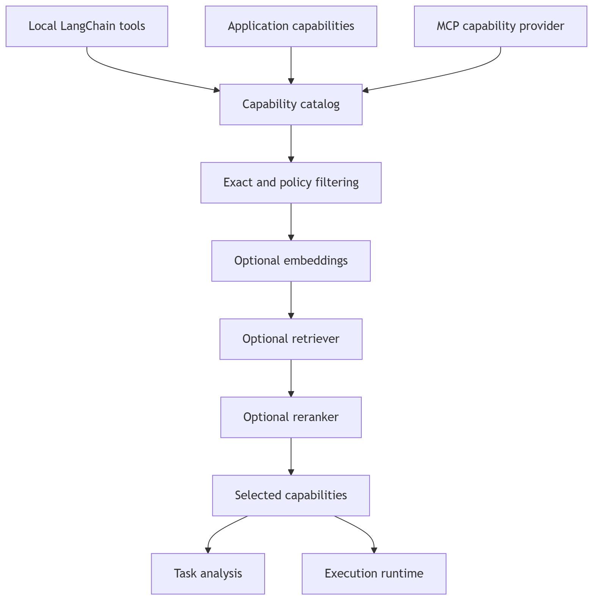

# Capability architecture

Agloom separates capability discovery, selection, and execution:

`CapabilityRegistry` is an abstract catalog contract.
`InMemoryCapabilityRegistry` is the default per-agent implementation.
`CapabilityDescriptor` gives every entry a stable name, description, kind,
provider, implementation value, and metadata. Local tools, application
services, and MCP entries are loaded through separate `CapabilityProvider`
implementations.

`DefaultCapabilityRouter` applies policy before selection. Without semantic
components it returns the policy-allowed catalog (bounded by
`max_selected_capabilities`). With routing components it preserves exact name
matches, optionally ranks with LangChain `Embeddings`, merges documents returned
by a LangChain `BaseRetriever`, and optionally reranks with
`BaseDocumentCompressor`. Retriever and reranker documents must identify their
entry through string metadata named `capability_name`.

The resulting selection is supplied to task analysis and execution.
Applications may inspect routing through
`agent.route_capabilities()` / `agent.aroute_capabilities()` and execute a named
entry through `agent.execute_capability()` / `agent.aexecute_capability()`.

First-party integration adapters target actual package APIs. All seven named
packages are required runtime dependencies; configuring/activating a capability
through `create_agent` remains explicit:

| Capability | Package |
|---|---|
| Feedback | `feedback-manager` |
| Behavior | `behaviorweave` |
| Context | `contextsage` |
| MCP routing | `mcp-capability-router` |
| Refresh | `refresh-engine` |
| Explainability | `langgraph-xai` |
| Structured output | `xstructured` |

The `*_options` mappings accepted by `create_agent` are passed directly to the
upstream constructors, preserving their package-defined defaults and validation.
ContextSage middleware and `langgraph-xai` instrumentation have direct runtime
integration; feedback, behavior, MCP, refresh, and structured-output instances
are registered as agent-local capabilities. MCP client initialization is
asynchronous; after registration the MCP provider discovers remote tools and
adds them under stable names such as `mcp:documents:remote_search`.

Agloom deliberately reuses LangChain's embedding, retrieval, reranking, and
tool contracts rather than defining competing interfaces. Memory, skills, and
caller-defined capabilities do not imply a mandatory database or skill loader.
