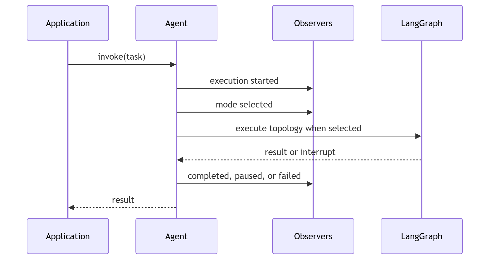

# Event model

Events are immutable, normalized records containing event name, timestamp,
agent identifier, invocation identifier, optional topology/worker identifiers,
and structured payload. The event sink is injected per agent; the default is a
no-op. Events cover agent creation, selection, direct start, capability
resolution, harness start, workers, tools, checkpoints, approval, pause/resume,
and terminal outcomes.

Event sink errors are surfaced or explicitly isolated only by a caller-selected
policy; the default must not silently convert a failed execution into success.
Secrets and raw credentials are not included in payloads. Event contracts are
extensible without tying Agloom to LangSmith.

