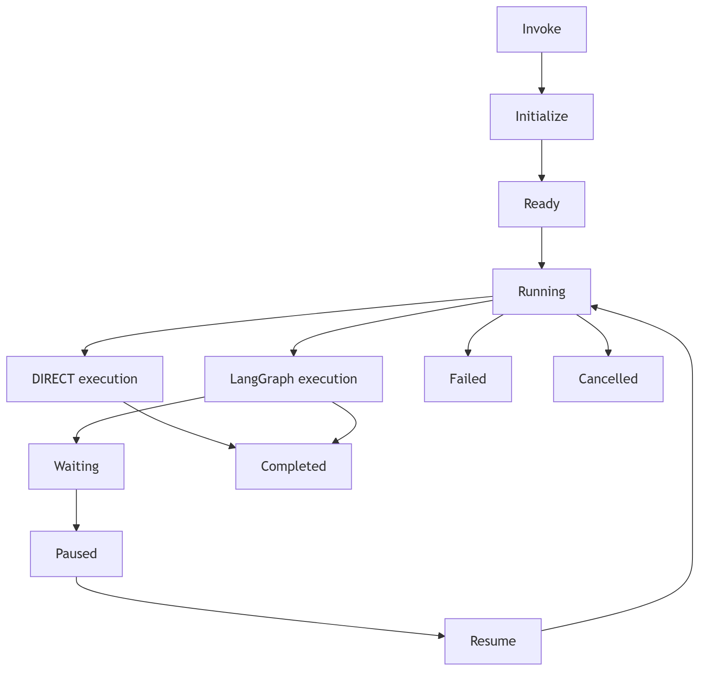

# Harness runtime

Each agent isolates invocation context, lifecycle transitions, event delivery,
cancellation, checkpoint configuration, streaming, and recursion budgets. It
uses LangGraph's graph execution and checkpoint semantics rather than
introducing a competing scheduler or persistence system.

Pause/resume and human approval use LangGraph interrupts and caller-supplied
checkpointers. They are available only for compiled graph execution and only
when the caller configures a checkpointer and a `checkpoint_authorizer` that
binds each caller-supplied thread ID to the authenticated principal. State
reads and resumes are authorized before reaching LangGraph. Unsupported DIRECT-path pause or resume raises a clear lifecycle error.
Recovery uses the supplied checkpointer's replay/resume semantics; Agloom does
not claim durable storage itself.

Concurrent invocations receive independent invocation state and cancellation
signals. Shared checkpointer identity/thread IDs are caller-controlled and must
be unique where independent persistence is required.

