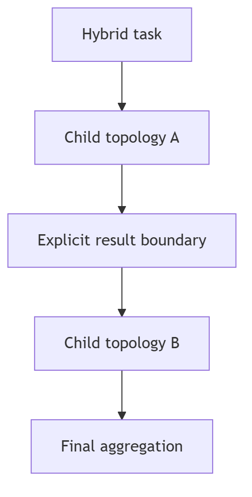

# Hybrid topology

Hybrid is the composition topology. Its configuration explicitly names at least
two child topologies; it is never inferred merely because the caller provides
multiple allowed candidates.

Initial constraints: only registered non-Hybrid topologies may be children;
composition has a maximum depth of two; children receive declared input and
return a declared result; sibling state is not shared implicitly. Child failures
fail the parent unless an explicit failure policy says collect-and-continue.
Recursion is separately governed by `RecursionPolicy` and does not bypass Hybrid
depth validation. Cycles and empty compositions are invalid.
