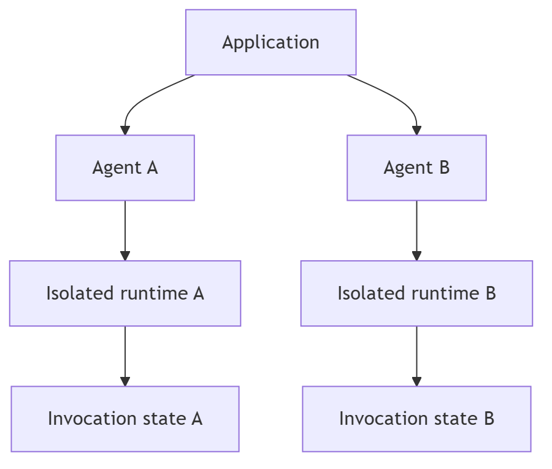

# Isolation model

Every call to `create_agent()` creates an isolated agent configuration,
observability pipeline, and recursion policy. Every invocation creates fresh
runtime state, lifecycle, cancellation, and recursion budget. User tools,
models, and capability instances are intentionally caller-shared references;
Agloom does not claim to make them thread-safe.

No package-global workers, counters, event subscribers, mutable blackboards, or
current-agent pointers are used. Applications sharing persistent checkpoint
storage must select distinct LangGraph thread IDs for independent runs.

