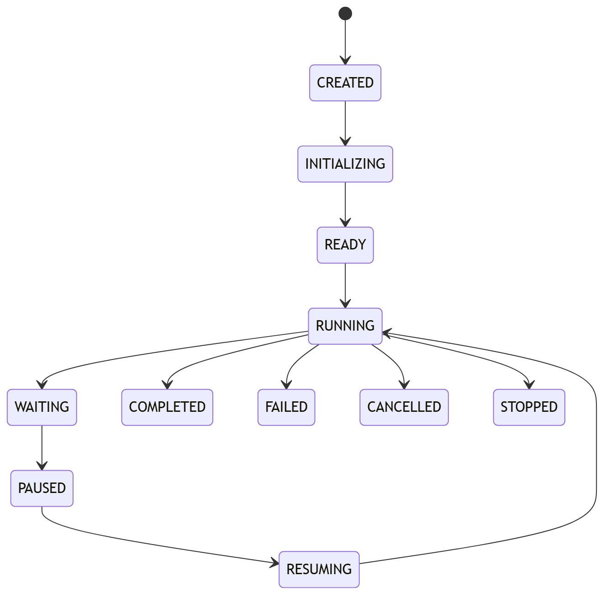

# Lifecycle model

Lifecycle transitions are validated: `CREATED -> INITIALIZING -> READY ->
RUNNING -> WAITING/PAUSED/RESUMING -> RUNNING -> COMPLETED`. `FAILED`,
`CANCELLED`, and `STOPPED` are terminal. Not every invocation traverses every
nonterminal state; DIRECT can move from READY to RUNNING to a terminal state.

Cancellation is cooperative and terminalizes the invocation without marking it
successful. Pause/resume is checkpoint-backed graph functionality. Illegal
transitions raise `LifecycleError`, and repeated terminalization is idempotent
only for the same terminal state.

