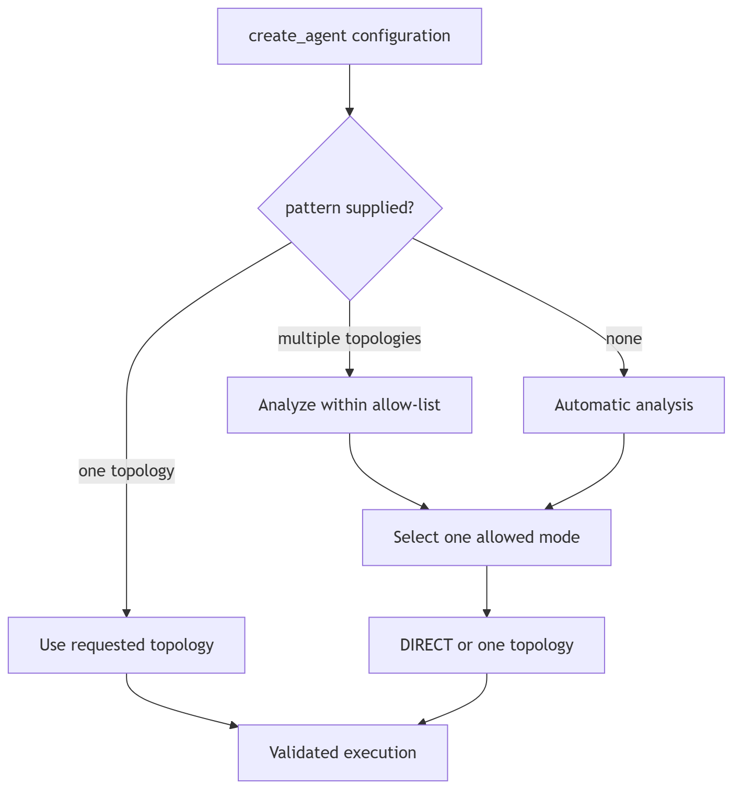

# Pattern selection

No pattern means analysis and strategy select DIRECT or one of eight topologies.
One pattern means validate and instantiate that topology without analyzer or
strategy selection. Several patterns require analysis and strategy, constrained
strictly to the supplied candidates. DIRECT is not an allowed pattern in a
topology-only list. Invalid names and empty lists raise `ConfigurationError`.
Selection errors are surfaced; they do not silently choose a different
topology. Automatic selection uses the configured LLM and the authoritative
inventory of available tools and capabilities. If the task needs an
unavailable capability, selection fails explicitly.

In automatic and allow-list modes, analysis can recommend:

- task-specific execution instructions and success criteria;
- suggested worker roles for Supervisor, Swarm, Blackboard, or Hybrid;
- suggested ordered stages for Pipeline or Hybrid;
- a suggested Hybrid composition.

Analysis cannot grant tools or capabilities. Developer-supplied
`system_prompt`, `workers`, `stages`, and `composition` override suggestions. A
single explicit topology continues to bypass analysis completely and uses
developer configuration or the topology's stable defaults.

Recursive child tasks are analyzed independently within `RecursionPolicy`
bounds, so each child receives task-specific instructions and roles rather than
blindly inheriting its parent's recommendations.
