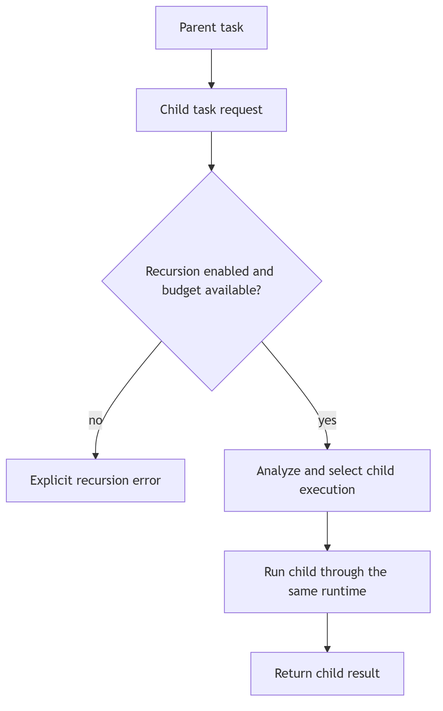

# Recursive execution

Recursion is a runtime capability, not a topology. A topology can request a
child task through the runtime callback. When enabled, that child is analyzed
and resolved afresh under the parent's remaining policy budget. When disabled,
child topology resolution is unavailable and a topology that requires it fails
clearly rather than silently spawning work.

Every child consumes a task budget; depth and worker limits are shared within
one agent invocation and never shared across agents. Child outputs are values,
not shared mutable graph state. Cancellation propagates parent-to-child.
