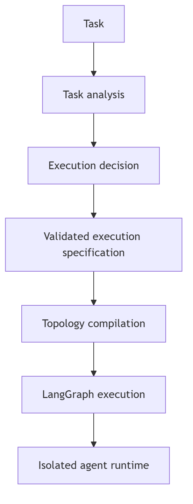

# Topology specification

Each topology has a stable lowercase name and predictable, bounded execution
semantics. Applications configure models, tools, capabilities, policies, and
runtime controls through `create_agent()` rather than topology-specific setup.

| Topology | Frozen execution semantics |
|---|---|
| ReAct | Model/tool/observation loop; terminate on final answer or bounded limit. |
| Supervisor | Supervisor chooses among a finite worker set; aggregate worker results. |
| Pipeline | Ordered stages pass typed state/results to the next stage. |
| Planner | Plan bounded subtasks, execute them, then aggregate in declared order. |
| Reflection | Produce, evaluate, revise until accepted or bounded revision limit. |
| Swarm | Bounded peer handoffs with an explicit next-worker choice and termination. |
| Blackboard | Workers read a versioned shared workspace and publish conflict-checked updates. |
| Hybrid | Explicit composition of child topologies with isolated child state boundaries. |

Worker count, handoff count, loop count, and recursive work are bounded.
Unsupported configurations fail explicitly rather than silently changing
topology behavior.

